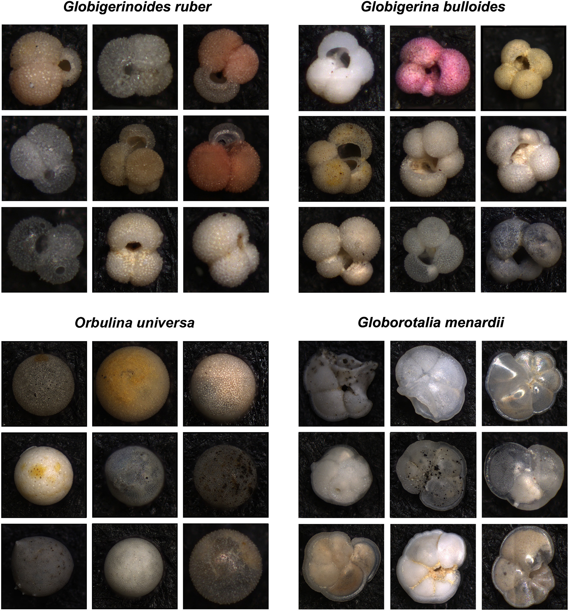

# Endless Forams - Pytorch Implementation

📚 [Paper](https://hal.science/hal-02975093v1) | 🌐 [Website](http://endlessforams.org) | ✏️ [Simple Training Loop](https://https://github.com/paulpaq98/EasyEndlessForams/blob/main/train_model_classification.py)




This repository contains a pytorch implementation for a training loop and a testing module based on the images from the endless forams dataset as described in:

> Hsiang AY, Brombacher A, Rilo MC, Mleneck-Vautravers MJ, Conn S, Lordsmith S, Jentzen A, Henehan MJ, Metcalfe B, Fenton I, Wade B, Fox L, Meilland J, Davis CV, Baranowski U, Groeneveld J, 
> Edgar KM, Movellan A, Aze T, Dowsett H, Miller G, Rios N & Hull PM. Endless Forams: >34,000 modern planktonic foraminiferal images for taxonomic training and automated species recognition 
> using convolutional neural networks. Paleoceanography and Paleoclimatology. 34(7):1157-1177. (https://doi.org/10.1029/2019PA003612)


Training images and a taxonomic training module can be found at Endless Forams.

Trainning images link : https://1drv.ms/u/s!AiQM7sVIv7fah4UKCwkj2wMbG2doUA?e=QnbK5I

to be unzipped and put in a data/img folder

## Setup

To set up the environment using Conda (recommended):
```
conda create -n forams python=3.10
conda activate forams
pip install -r requirements.txt
```
## Running Code

Start by running a training classification script


##### Run example minimalistic training for an efficientNetV2

```
python .\train_model_classification.py 
```

A model will be saved in the models\classification folder. 

The naming convention for the models is as follow : 
```
LossType_DataType_Model_Name.pth
```

* *LossType* is the loss used for the training : ce (CrossEntropy) | cb (ClassBalance) | focal (FocalLoss) | cbfocal (ClassBalance + FocalLoss) | smoothing (CrossEntropy + LabelSmoothing)
* *DataType* is the kind of data used for the training : raw | masked 
* *Model_Name* is the name of the model used for the training : effNet_small | effNet_medium | effNet_large | swin_tiny | ConvNeXt_tiny | convNeXt_base

in this example the name of the model will be : ce_raw_effNet_small.pth

##### Run example minimalistic testing 

```
python .\test_model_classification.py --path_pretrain models\classification\ce_raw_effNet_small.pth
```


## Repo Structure

```
├───assets
├───data
│   ├───img
│   └───masks
├───models
│   ├───classification  
│   ├───detection
│   └───generation
├───outputs
│   ├───classification
│   │   ├───accuracy_curve
│   │   ├───f1_curve
│   │   ├───loss_curve
│   │   └───confusion_matrix
│   ├───detection
│   └───generation
└───utils
```
